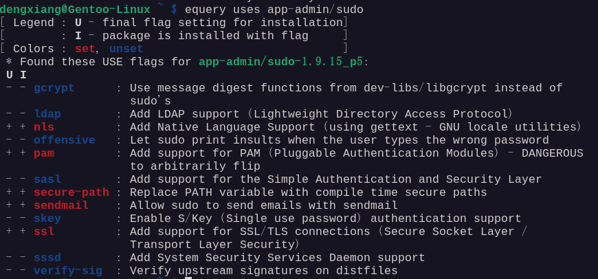
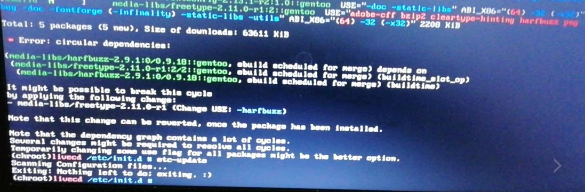
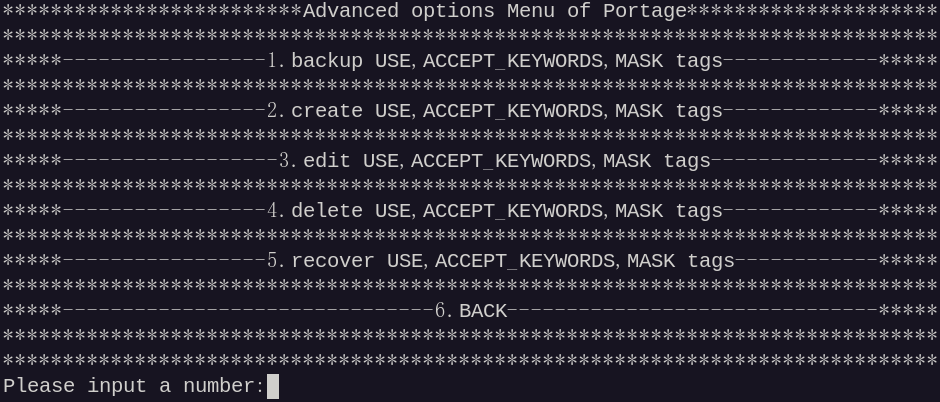
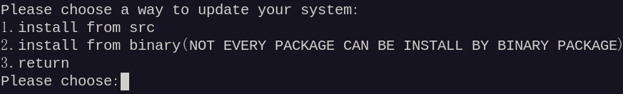

# Gentoo-PackageManager

#### Description

Gentoo-PackageManager,a package TUI(Text User Interface) manager of portage by C programing,is included many useful functions,ranging from checking installed packages,updating system to editing repository.

#### Software Architecture

In terms of source portability,the software theoretically support all architectures.Only support Gentoo GNU/Linux

#### Installation

Install dependencies:
app-eselect/eselect-repository,app-portage/gentoolkit,app-admin/sudo,app-text/tree,app-editors/neovim

Please execute "emerge --ask app-eselect/eselect-repository app-portage/gentoolkit app-admin/sudo,app-text/tree,app-editors/neovim" to install dependencies.

install:
Download the package on the Release and unzip it and run the install.sh to install it, and use the uninstall.sh to uninstall 😃 it

Install from source code: This operation is risky, and the compiled program may be problematic, please be cautious 😕

Compilation Options: 
Run "make all" to compile everything

Run "make zh" to compile only the Chinese version

Run "make en" to compile only the English version (not recommended 😕)

Run "make package" to package the software as a "tar.gz" file

 Installation && Uninstallation Options: 
 
 Run ”make install_en“ install the English version
 
 Run the "make install_zh" install the Chinese version ("make zh && install_zh", "make en && make install_en" will make the language switching option unavailable!! 😟 )
 
 Run the make install command to install the dual-language version, the default selection of Chinese

make uninstall:You know the command that used to uninstall the software

Cleaning Options:

make clean_all:Clean all the files

make clean_excess_files:Clean the files produced by the C compiler,such as ".o" file

make clean_rmpkg:delete the packaged file(tar.gz file)

#### Instructions

Please enter numbers and do not enter strings at random.
Considering that it is used on the server, it temporarily supports English! Chinese follow-up support (please run under X11, wayland or a terminal that supports Chinese for the Chinese version).
Please follow the menu prompts.

#### About Portage knowledges

USE,ACCEPT_KEYWORDS,MASK tags are important part in Gentoo GNU/Linux or Musl C  version of the Gentoo Linux that can control package installing,upgrading,downgrading,masking and blocking operations.(Most of the images come from Gentoo user forums, and a few come from Baidu Tieba and other sources)

USE:
USE tags can customize the features of packages,which determines whether the software you install can be acquired and installed in binary form and determines how many features are included in the software you install. By adding or removing USE tags, the dependencies of the package may be increased or reduced, and the value appreciation will lead to the circular dependency of the package, which will bring unnecessary trouble to the system update.Even package dependency conflicts can occur due to USE tags, causing system updates to fail

e.g.

  
  
  

ACCEPT_KEYWORDS:
When installing Gentoo, ACCEPT_KEYWORDS="amd64" or ACCEPT_KEYWORDS="~amd64" will appear when selecting a stable or unstable branch of the software, which decide how often the system or software is updated. Some software is also blocked for this reason, and it is possible to install the blocked package by manually modifying the ACCEPT_KEYWORDS.

e.g.

  
  

MASK:
With the MASK tag,we can lock the version of a package or block packages that we don't need. However, for system updates, this operation is more dangerous, and you need to consider the dependency problems caused by USE tags.The masking of packages is related to ACCEPT_KEYWORDS tags.

e.g.
  

#### Introduction to the software interface

the following interface is screenshotted on gnome45:

  

  

  

  

  

#### Author's statement

None :laughing:
