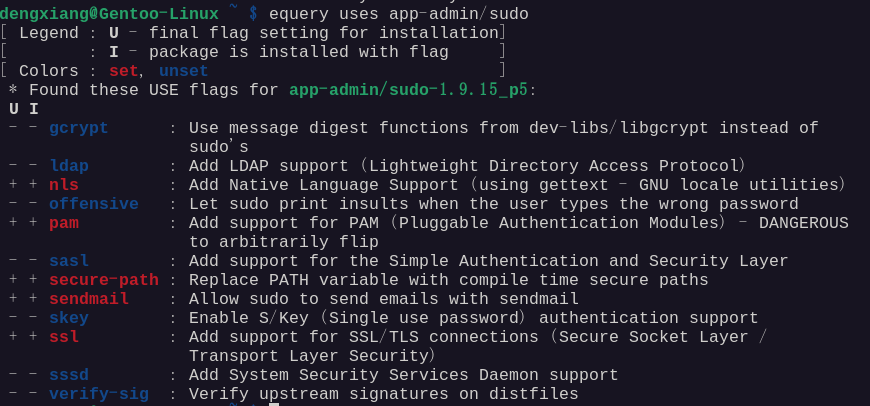
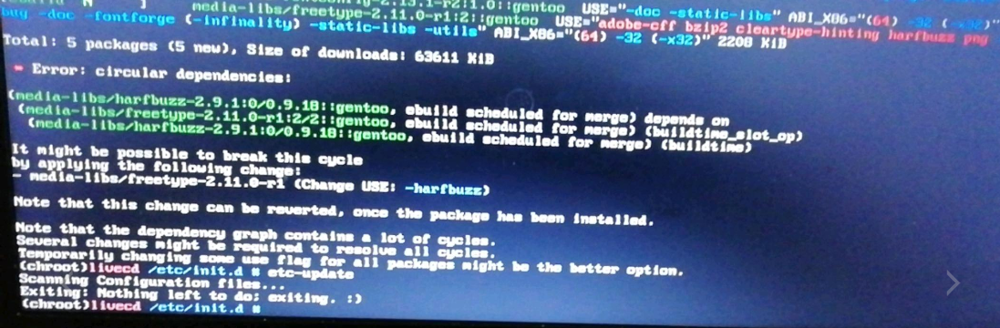
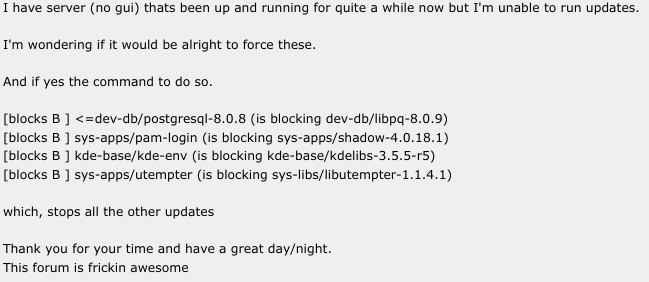
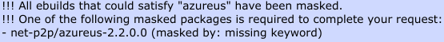
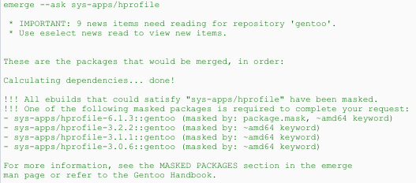
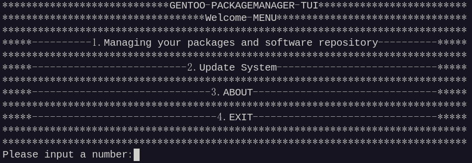
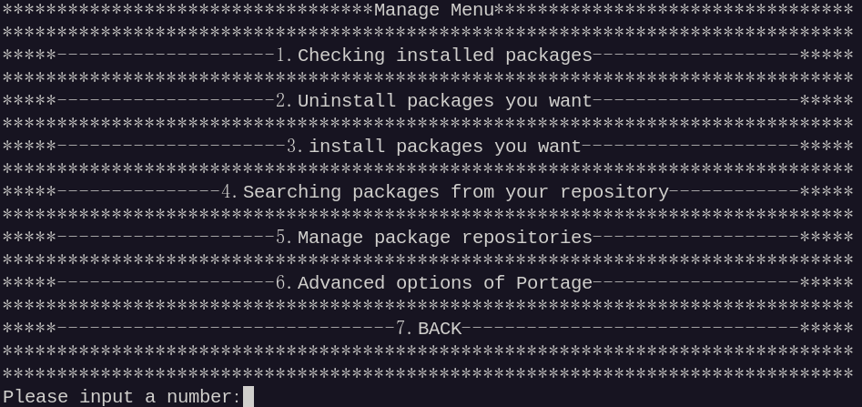
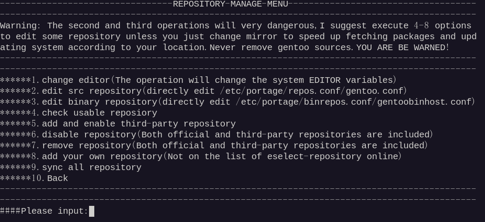
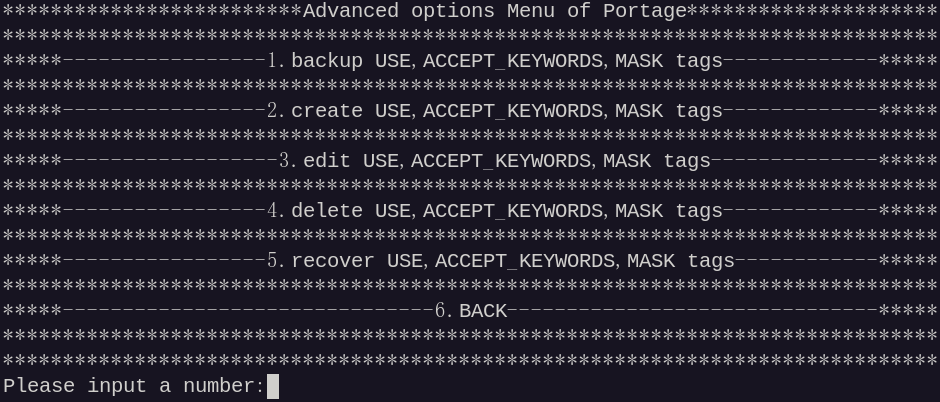
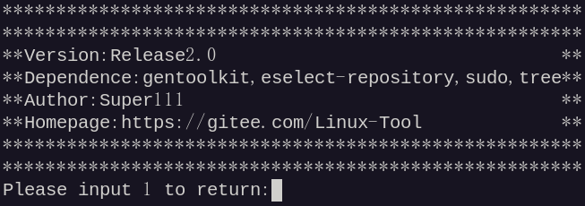

#### 介绍

使用C语言编写的Gentoo TUI 的portage包管理系统前端工具，包括查看已安装软件，更新系统，更改软件仓库等功能

#### 软件架构

软件架构说明
从源码可移植性上来讲，理论上支持全架构

#### 安装教程

安装依赖：app-portage/gentoolkit,app-eselect/select-repository,app-admin/sudo,app-text/tree
执行make、make install 即可，如需卸载，请删除"/usr/bin/gentoo-packagemanager"即可
也可以下载Release上的包解压并执行install.sh来安装，用uninstall.sh来卸载

#### 使用说明

请以输入数字的方式进行操作，切勿随意输入字符串。
考虑到使用在服务器上，故暂时支持英文！中文后续支持（中文版本请在X11,wayland或支持中文的终端下运行）
根据菜单提示进行操作.

#### 关于Portage知识

USE，ACCEPT_KEYWORDS，MASK标签是Gentoo GNU/Linux或"Musl C" Gentoo Linux中的重要部分，可以控制软件包的安装、升级、降级、屏蔽和阻塞操作。(图片来源多来自Gentoo用户论坛，少数来自百度贴吧以及其他来源)

USE：
USE标签可以自定义软件包的功能，这决定了你安装的软件是否可以以二进制形式获取和安装，并决定了你安装的软件包含多少功能。通过添加或删除 USE 标签，可能会增加或减少包的依赖性，而增值会导致包的循环依赖，这会给系统更新带来不必要的麻烦。甚至由于 USE 标记，也可能发生包依赖冲突，从而导致系统更新失败

e.g.

  
  
  

ACCEPT_KEYWORDS：
安装Gentoo时，选择软件的稳定或不稳定分支时会出现ACCEPT_KEYWORDS=“amd64”或ACCEPT_KEYWORDS=“~amd64”，这决定了系统或软件的更新频率。由于这个原因，一些软件也被阻止了，可以通过手动修改ACCEPT_KEYWORDS来安装被阻止的软件包。

e.g.

  
  

MASK:
使用 MASK 标签，我们可以锁定一个包的版本或阻止我们不需要的包。但是，对于系统更新来说，这个操作比较危险，需要考虑USE标签带来的依赖问题。包的屏蔽与ACCEPT_KEYWORDS标签有关。

e.g.

#### 界面展示

以下界面均在Gentoo gnome45上所截的图

  

  

  

  

  

#### 作者自述

暂无(没有什么好说的) :laughing:
目前暂时无其他更新，可能仅维护并开始开发并完善中文版本