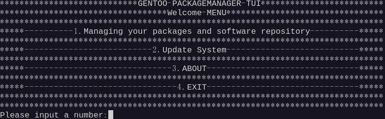
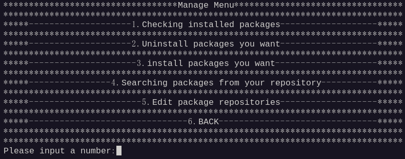
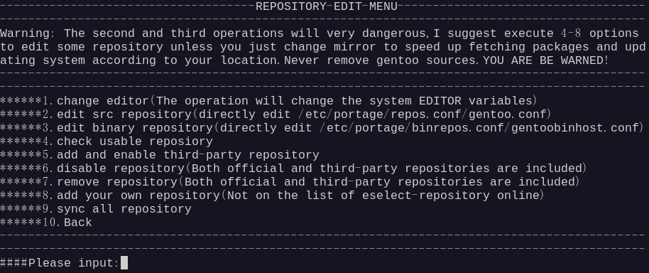
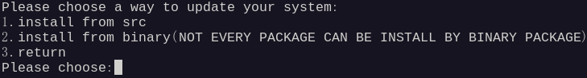

#### 介绍

使用C语言编写的Gentoo TUI 的portage包管理系统前端工具，包括查看已安装软件，更新系统，更改软件仓库等功能

#### 软件架构

软件架构说明
从源码可移植性上来讲，理论上支持全架构

#### 安装教程

安装依赖：gentoolkit、select-repository、sudo
执行make、make install 即可，如需卸载，请删除"/usr/bin/gentoo-packagemanager"即可
也可以下载Release上的包解压并执行install.sh来安装，用uninstall.sh来卸载

#### 使用说明

请以输入数字的方式进行操作，切勿随意输入字符串。
考虑到使用在服务器上，故暂时支持英文！中文后续支持（中文版本请在X11,wayland或支持中文的终端下运行）
根据菜单提示进行操作.

#### 界面展示

这是软件的主页面(以下界面均在gnome45上所截的图)

这是软件包管理页面

这是编辑软件仓库的菜单

这是系统更新界面

